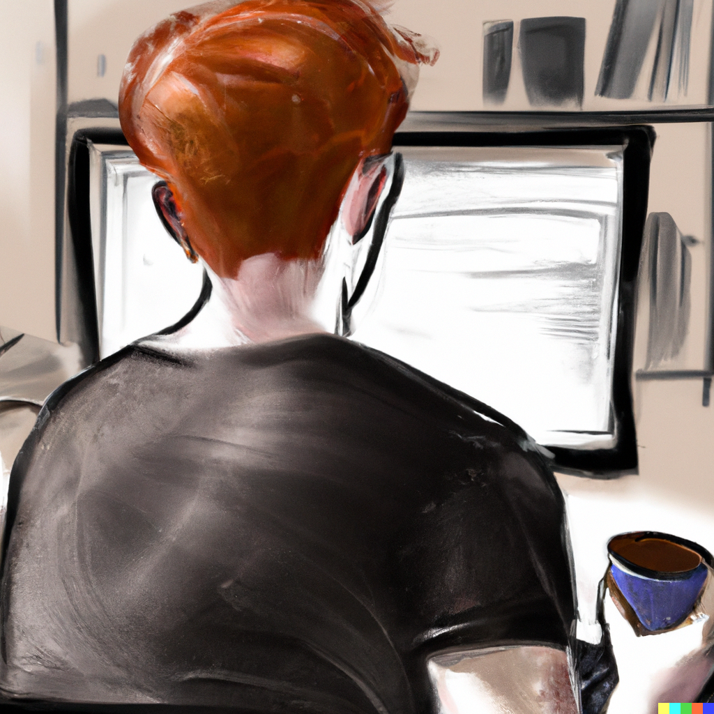

   
Hi, there! :wave:  
I'm Philipp, PhD Candidate at TU Dortmund University.   

    
    
    
    

## My Projects

## About Me

- PhD Candidate at TU Dortmund University
- Research area focused on Uncertainty Quantification of (Deep) Neural Networks
- Interested in microelectronics for IoT applications

## Tools I Use

## My Stats

    

    

  
Note: The profile picture at the top was generated by OpenAI's <a href="https://openai.com/dall-e-2/">DALL-E 2</a>.

